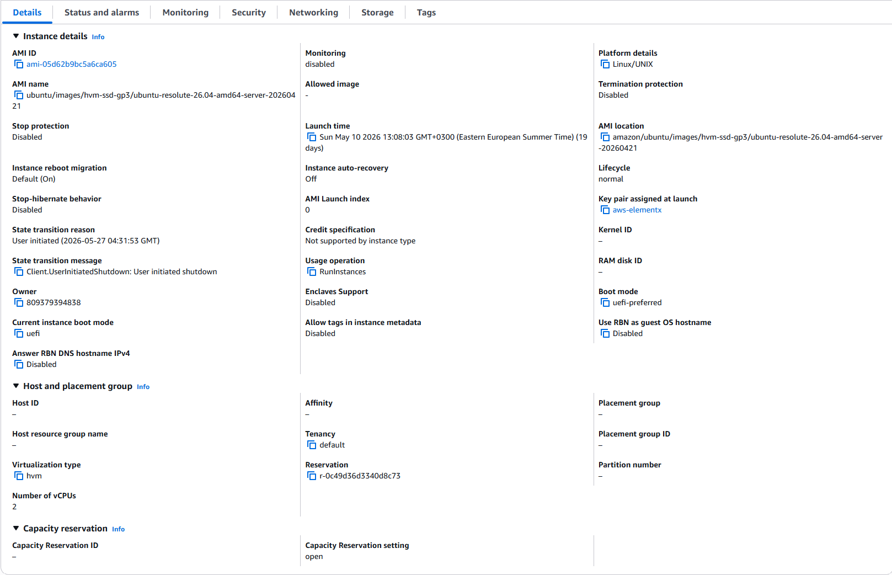
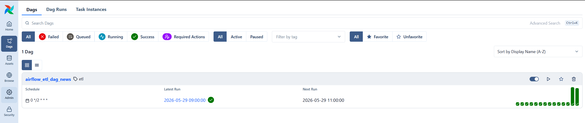
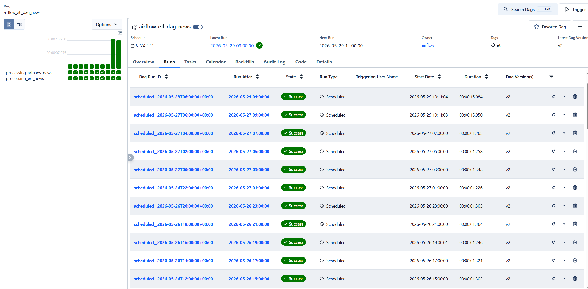

# EC2 — Airflow orkestreerimine

EC2 instants hostib Apache Airflow keskkonda, mis orkestreerib uudiste ETL-protsessi. Airflow käivitatakse Docker Compose abil ja see töötab CeleryExecutor režiimis koos Redis ja PostgreSQL teenustega.

## EC2 instants

- **AMI:** Ubuntu 26.04 LTS (`ubuntu-resolute-26.04-amd64-server`)
- **Platvorm:** Linux/UNIX
- **vCPU-d:** 2
- **vMälumaht:** 8GB



## Airflow

Airflow on paigaldatud Docker Compose abil (`docker-compose.yaml`) ning kasutab järgmisi teenuseid:

| Teenus | Kirjeldus |
|--------|-----------|
| `postgres` | Airflow metaandmebaas (PostgreSQL 16) |
| `redis` | Celery sõnumivahendaja (Redis 7.2) |
| `airflow-apiserver` | Airflow veebiserver (port 8080) |
| `airflow-scheduler` | DAG-ide ajastaja |
| `airflow-dag-processor` | DAG-ide töötleja |
| `airflow-worker` | Celery töötaja |
| `airflow-triggerer` | Trigerite haldur |

### DAG-id: Uudiste transformatsioonid (Transform & Load)

Projekti transformatsiooni loogika on jaotatud kolmeks eraldi transformatsiooni DAG-iks, mis töötlevad andmeid `bronze` kihist `silver` kihti:

1. **`transform_err_bronze_to_silver`** — loeb toored ERR andmed skeemist `bronze`, parsib artiklid, filtreerib välja soovimatud kategooriad ning salvestab unikaalsed uudised ja kategooriad `silver` kihis.
2. **`transform_aripaev_bronze_to_silver`** — loeb toored Äripäeva andmed skeemist `bronze`, parsib artiklid, filtreerib välja soovimatud kategooriad ning salvestab unikaalsed uudised ja kategooriad `silver` kihis.
3. **`transform_postimees_bronze_to_silver`** — loeb toored Postimehe andmed skeemist `bronze`, parsib artiklid, filtreerib välja soovimatud kategooriad ning salvestab unikaalsed uudised ja kategooriad `silver` kihis.

Märkus: Vanem monoliitne DAG (`airflow-etl-dag-news.py`) on märgitud aegunuks (deprecated).

Kõik DAG-id:
- Loevad uusi toorandmeid `bronze.raw` tabelist, mis on lisatud pärast viimast töötlust.
- Parsivad XML artiklid BeautifulSoup abil.
- Filtreerivad välja soovimatud kategooriad (nt Teater, Galerii, Saated, Digiajakirjad jne).
- Kasutavad **inkrementaalset laadimist** — kontrollivad viimati töödeldud `bronze.raw.id` väärtust `silver.news_incremental` tabelis ja uuendavad seda jooksvalt.
- Sisestavad uued uudised `silver.news` tabelisse ning seovad need kategooriatega `silver.news_categories` tabelis.
- Kasutavad Airflow `PostgresHook` ühendust nimega `aws-postgres`.





## Failide struktuur

```
EC2/
├── airflow/
│   ├── airflow-etl-dag-news.py   # Airflow DAG (aegunud monoliit)
│   ├── airflow-transform-err.py  # ERR transformatsiooni DAG
│   ├── airflow-transform-aripaev.py # Äripäev transformatsiooni DAG
│   ├── airflow-transform-postimees.py # Postimees transformatsiooni DAG
│   ├── extract_news.py           # Standalone uudiste ekstraktimise skript
│   ├── docker-compose.yaml       # Airflow Docker Compose konfiguratsioon
│   ├── airflow_pg_hook_example.txt
│   ├── .env.example              # Keskkonnamuutujate näidis
│   └── requirements.txt          # Pythoni sõltuvused
├── airflow1.png                  # EC2 instansi kuvatõmmis
├── airflow2.png                  # Airflow DAG-ide kuvatõmmis
├── airflow3.png                  # DAG käivituste ajaloo kuvatõmmis
└── README.md                     # Ülevaade
```

## Käivitamine

```bash
# 1. Kopeeri keskkonnamuutujad
cp airflow/.env.example airflow/.env
# Muuda .env failis andmebaasi ja Airflow seaded

# 2. Käivita Airflow
cd airflow
docker compose up -d

# 3. Airflow veebiliides
# http://localhost:8080 (kasutaja/parool: airflow)
```

## Keskkonnamuutujad

| Muutuja | Kirjeldus |
|---------|-----------|
| `DB_DATABASE` | Andmebaasi nimi (`db_news`) |
| `DB_USERNAME` | Andmebaasi kasutaja |
| `DB_HOSTNAME` | RDS hosti aadress |
| `DB_PASSWORD` | Andmebaasi parool |
| `AIRFLOW_UID` | Airflow kasutaja ID |
| `_AIRFLOW_WWW_USER_USERNAME` | Airflow veebi kasutajanimi |
| `_AIRFLOW_WWW_USER_PASSWORD` | Airflow veebi parool |
