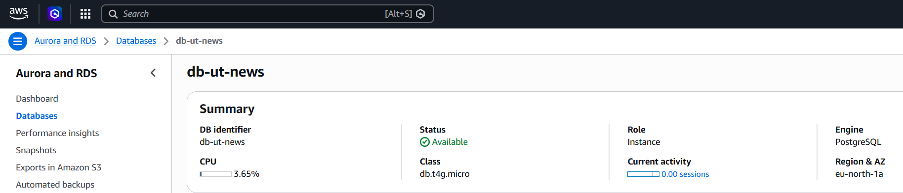
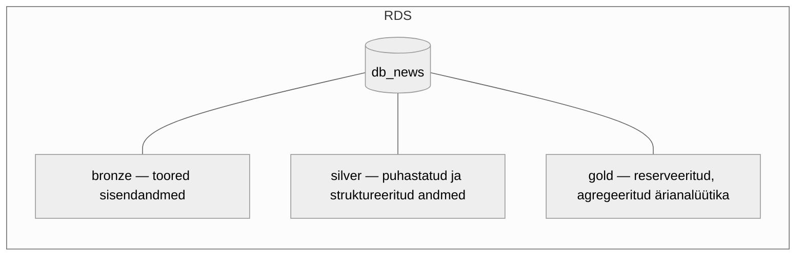
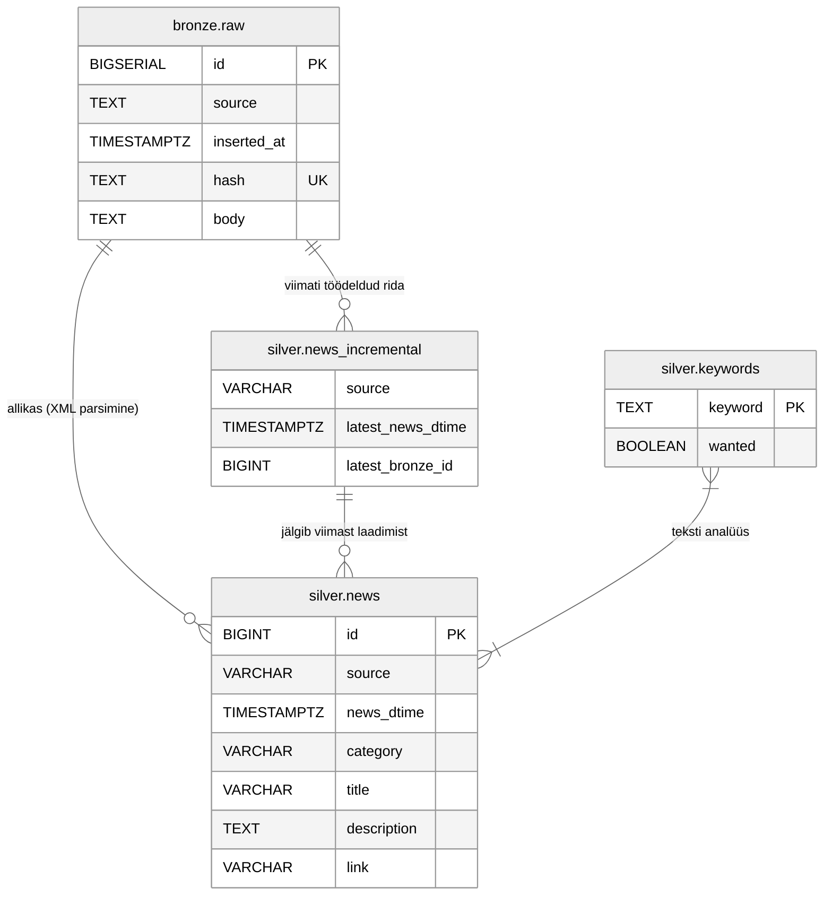

# RDS — PostgreSQL andmebaas

Amazon RDS PostgreSQL andmebaas on projekti keskne andmehoidla. Andmebaas kasutab medaljonarhitektuuri (bronze → silver → gold) kihtidega.

## RDS instants

| Parameeter | Väärtus |
|------------|---------|
| **DB identifier** | `db-ut-news` |
| **Mootor** | PostgreSQL |
| **Klass** | `db.t4g.micro` |
| **Regioon** | `eu-north-1a` |
| **Staatus** | Available |



## Andmebaasi struktuur

Andmebaas `db_news` kasutab kolme skeemi:



### Bronze kiht — `bronze.raw`

Toored RSS XML-andmed, mille Lambda funktsioonid salvestavad:

| Veerg | Tüüp | Kirjeldus |
|-------|------|-----------|
| `id` | BIGSERIAL PK | Automaatne primaarvõti |
| `source` | TEXT NOT NULL | Allika nimi (ERR / ÄRIPÄEV) |
| `inserted_at` | TIMESTAMPTZ | Sisestamise ajatempel (DEFAULT NOW()) |
| `hash` | TEXT UNIQUE | MD5 räsi deduplikatsiooniks |
| `body` | TEXT NOT NULL | Toore RSS XML sisu |

Indeks: `idx_hash` veeru `hash` peal kiireks räsiotsinguks.

### Silver kiht — `silver.news`

Parsitud ja puhastatud uudiste tabel:

| Veerg | Tüüp | Kirjeldus |
|-------|------|-----------|
| `id` | BIGINT PK (IDENTITY) | Surrogaatvõti |
| `source` | VARCHAR | Allikas (ERR / AP) |
| `news_dtime` | TIMESTAMPTZ | Uudise avaldamise aeg |
| `category` | VARCHAR | Uudise kategooria |
| `title` | VARCHAR | Pealkiri |
| `description` | TEXT | Uudise kirjeldus/lühikokkuvõte |
| `link` | VARCHAR | Link originaaluudisele |

### Silver kiht — `silver.news_incremental`

Inkrementaalse laadimise jälgimistabel:

| Veerg | Tüüp | Kirjeldus |
|-------|------|-----------|
| `source` | VARCHAR(10) | Allikas (ERR / AP) |
| `latest_news_dtime` | TIMESTAMPTZ | Viimase töödeldud uudise ajatempel |
| `latest_bronze_id` | BIGINT | Viimati töödeldud `bronze.raw` rea ID |

### Silver kiht — `silver.keywords`

Märksõnade tabel teksti analüüsiks ja stoppsõnade filtreerimiseks:

| Veerg | Tüüp | Kirjeldus |
|-------|------|-----------|
| `keyword` | TEXT PK | Märksõna |
| `wanted` | BOOLEAN | `TRUE` = otsitav märksõna, `FALSE` = stoppsõna |

**Soovitud märksõnad** (geopoliitilised teemad): `trump`, `usa`, `ameerika`, `ukraina`, `venemaa`, `iraan`, `hiina`, `taiwan`, `zelenski`, `putin`, `xi` jm.

**Stoppsõnad**: eesti keele levinumad sidesõnad, asesõnad ja muud semantiliselt tühjad sõnad (~200 sõna).

## Tabelite seosed




## Failide struktuur

```
RDS/
├── db_setup.sql                          # Andmebaasi ja tabelite loomine
├── bronze.sql                            # Bronze kihi tabeli loomine
├── Kuvatõmmis 2026-05-29 100705.png      # RDS instansi kuvatõmmis
└── README.md
```
