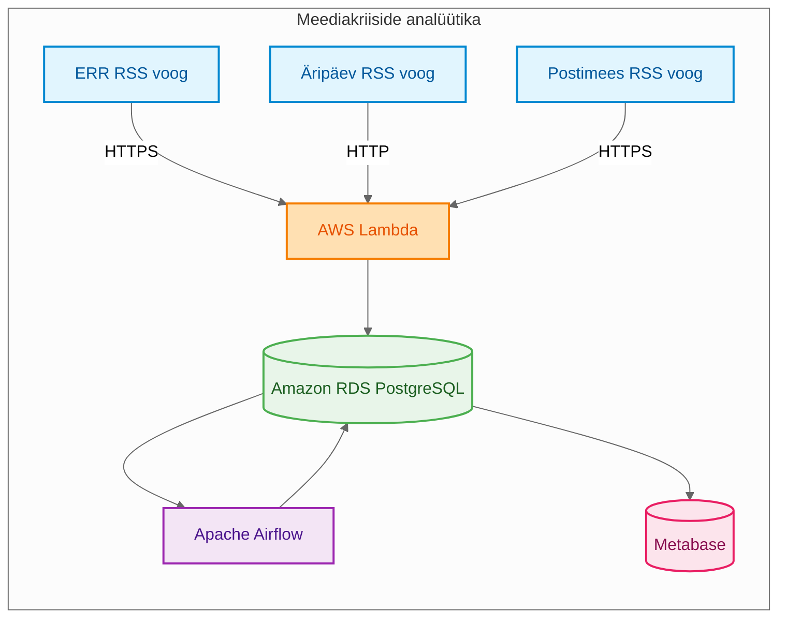

# Naksitrallid — Kriisikollete kajastus Eesti meedias

## Äriküsimus

Geopoliitiliste kriiside ja nendega seotud isikute kajastatuse osakaal ning temaatiline jaotus Eesti meediamaastikul ERR-i, Äripäeva ja Postimehe uudistevoogude näitel.

**Mõõdikud:**

1. Millise osakaalu kogu meediamahtudest moodustavad sihtriikidega (USA, Iraan, Iisrael, Ukraina, Venemaa) ja nendega seotud isikutega seonduvad uudised ERR-is, Äripäevas ning Postimehes päeva lõikes. Kogume valimi märksõnu nagu "USA, Trump, Iraan ... jne." Loeme kokku uudised, mis päevas sisaldavad neid sõnu ja vaatame kogusuhet päevastesse uudistesse.
2. Millistes temaatilistes kategooriates ja rubriikides nimetatud meediakanalid antud geopoliitilisi konflikte kajastavad? Uudistel on olemas kategooriad. Grupeerime ülalnimetatud märksõnadega uudised neisse kategooriatesse.

## Arhitektuur



Täpsem joonis ja kirjeldus: [`docs/arhitektuur.md`](docs/arhitektuur.md)

## Andmestik

| Allikas | Tüüp | Ajas muutuv? | Roll |
|---------|------|--------------|------|
| [ERR RSS](https://www.err.ee/rss) | RSS | Jah, iga tund | Põhiandmevoog |
| [Äripäev RSS](http://feeds.feedburner.com/aripaev-rss) | RSS | Jah, iga tund  | Põhiandmevoog |
| [Postimees RSS](https://postimees.ee/rss) | RSS | Jah, iga tund  | Põhiandmevoog |

## Stack

| Komponent | Tööriist | Kirjeldus |
|-----------|---------|-----------|
| Sissevõtt (Extract) | AWS Lambda | Tõmbab RSS voo ja salvestab toore XML sisu `bronze.raw` tabelisse |
| Transformatsioon (Transform & Load) | Airflow (Python & SQL) | Eraldi DAG-id allikatele (ERR, Äripäev, Postimees), loevad `bronze` kihist ja kirjutavad `silver` kihi tabelitesse |
| Andmehoidla | Amazon RDS PostgreSQL | Medaljonarhitektuur (bronze -> silver -> gold) |
| Näidikulaud | Metabase | Ärianalüütika ja visuaalid |
| Orkestreerimine | Airflow | Käivitab transformatsiooni (hetkel testimisel, kulude säästmiseks käsitsi või tunnisel graafikul) |

## Käivitamine ja seadistamine

Kuna projekt kasutab erinevaid AWS-teenuseid, on käivitamine ja seadistamine jagatud komponentide kaupa:

### 1. Andmebaas (Amazon RDS PostgreSQL)
Projekti andmebaas asub Amazon RDS-is (mootor: PostgreSQL, klass: `db.t4g.micro`).
- Andmebaasi skeemide (`bronze`, `silver`, `gold`), tabelite ja algsete märksõnade seadistamiseks tuleb andmebaasis käivitada skript [db_setup.sql](file:///c:/Users/arnop/ut-aik-grupitoo/RDS/db_setup.sql).
- Täpsem info andmebaasi struktuuri kohta asub kataloogis [RDS/README.md](./RDS/README.md).

### 2. Sissevõtt (AWS Lambda & Amazon EventBridge)
Uudistevoogude tõmbamiseks ja toorandmete salvestamiseks `bronze.raw` tabelisse kasutatakse kolme serverless AWS Lambda funktsiooni: `rss-fetcher-err`, `rss-fetcher-aripaev` ja `rss-fetcher-postimees`.
- Lambda funktsioonide kood asub failis [lambda_function.py](./lambda/lambda_function.py).
- Funktsioonide käivitamist reguleerib Amazon EventBridge Scheduler kord tunnis.
- Rohkem detaile sissevõtu seadistamise kohta leiab juhendist [lambda/README.md](./lambda/README.md).

### 3. Transformatsioon ja orkestreerimine (AWS EC2 & Apache Airflow)
Apache Airflow keskkond töötab AWS EC2 instantsis (Ubuntu 26.04 LTS) Docker Compose abil.
Airflow käivitamiseks masinas:
1. Liigu Airflow kausta:
   ```bash
   cd EC2/airflow
   ```
2. Kopeeri keskkonnamuutujate näidis ja seadista see (vt [Saladused](#saladused-ja-konfiguratsioon)):
   ```bash
   cp .env.example .env
   ```
3. Käivita Airflow teenused:
   ```bash
   docker compose up -d
   ```
4. Ava veebiliides: `http://<EC2-IP>:8080` (kasutaja/parool seadistatakse `.env` failis).
5. Lisaks tuleb Airflow veebiliideses luua andmebaasi ühendus nimega `aws-postgres` (tüüp: Postgres), mis viitab Amazon RDS andmebaasile.
- Täpsem info asub juhendis [EC2/README.md](./EC2/README.md).

### 4. Näidikulaud (Metabase)
Metabase töötab Docker Compose abil kas lokaalselt või EC2 virtuaalmasinas.
1. Liigu Metabase kausta:
   ```bash
   cd metabase
   ```
2. Kopeeri keskkonnamuutujate fail ja seadista see:
   ```bash
   cp .env.example .env
   ```
3. Käivita teenused:
   ```bash
   docker compose up -d
   ```
4. Ava Metabase veebiliides: `http://localhost:3000` (või vastaval EC2 pordil).
5. Ühenda Metabase oma RDS andmebaasiga veebiliidese seadete kaudu.
- Täpsem info asub juhendis [metabase/README.md](./metabase/README.md).

## Saladused ja konfiguratsioon

Kuna rakendus on jaotatud erinevate AWS teenuste vahel, hallatakse konfiguratsiooni ja saladusi (paroolid, hosti aadressid jne) mitmel tasandil. Neid ei lisata repositooriumisse ja need on lisatud `.gitignore` faili.

### 1. AWS Lambda & AWS KMS
AWS Lambda keskkonnamuutujad konfigureeritakse AWS-i konsoolis või deploy skriptides:
- `SOURCE_NAME` — allika nimi (nt `ERR` või `ARIPAEV`).
- `RSS_URL` — RSS voo aadress.
- `DB_HOST` — RDS hosti endpoint.
- `DB_PORT` — RDS andmebaasi port (vaikimisi 5432).
- `DB_NAME` — andmebaasi nimi (nt `db_news`).
- `DB_USER` — andmebaasi kasutaja.
- `DB_PASSWORD` — **AWS KMS (Key Management Service) abil krüpteeritud parool**. Lambda funktsioon dekrüpteerib selle käivitamisel cold start optimeerimisega.

### 2. Airflow (EC2) keskkonnamuutujad (`EC2/airflow/.env`)
Airflow ja selle DAG-ide käivitamiseks vajalikud seaded asuvad failis [EC2/airflow/.env.example](file:///c:/Users/arnop/ut-aik-grupitoo/EC2/airflow/.env.example):
- `DB_DATABASE` — RDS andmebaasi nimi.
- `DB_USERNAME` — RDS andmebaasi kasutaja.
- `DB_HOSTNAME` — RDS andmebaasi hosti endpoint.
- `DB_PASSWORD` — RDS andmebaasi parool.
- `AIRFLOW_UID` — Airflow failiõiguste kasutaja ID.
- `_AIRFLOW_WWW_USER_USERNAME` — Airflow veebiliidese administraatori kasutajanimi.
- `_AIRFLOW_WWW_USER_PASSWORD` — Airflow veebiliidese administraatori parool.

### 3. Metabase keskkonnamuutujad (`metabase/.env`)
Metabase enda metaandmebaasi konfigureerimiseks kasutatakse faili [metabase/.env.example](file:///c:/Users/arnop/ut-aik-grupitoo/metabase/.env.example):
- `DB_NAME` — Metabase metaandmebaasi nimi.
- `DB_USER` — Metabase metaandmebaasi kasutaja.
- `DB_PASSWORD` — Metabase metaandmebaasi parool.
- `DB_DATA_DIR` — PostgreSQL andmekataloog konteineris.
- `MB_PORT` — Metabase rakenduse port (vaikimisi 3000).
- `MB_JAVA_TIMEZONE` — ajavöönd (nt `Europe/Tallinn`).

## Andmevoog lühidalt

1. **Sissevõtt (Extract)** — AWS Lambda funktsioonid tõmbavad regulaarselt ERR, Äripäeva ja Postimehe RSS-vooge ning lisavad need unikaalsuse kontrolliga (MD5 räsi) `bronze.raw` tabelisse. Kuna see on serverless ja odav, saab seda jooksutada pidevalt.
2. **Laadimine & Transformatsioon (Transform & Load)** — Airflow eraldiseisvad DAG-id (`transform_err_bronze_to_silver`, `transform_aripaev_bronze_to_silver`, `airflow-transform-postimees.py`) loevad toorandmeid skeemist `bronze`, viivad läbi transformatsioonid, filtreerivad lubamatud kategooriad ning kirjutavad tulemused `silver.news` tabelisse. Kulude kokkuhoiuks käivitatakse neid vajadusel käsitsi või korra tunnis (säästes EC2 tööaega).
3. **Inkrementaalsus** — Airflow jälgib viimati töödeldud rea ID-d (`latest_bronze_id`) tabelis `silver.news_incremental`, tagades, et igal käivitamisel töödeldakse vaid uusi toorandmeid.
4. **Testimine** — Andmekvaliteedi testid kontrollivad andmete terviklikkust.
5. **Näidikulaud** — Metabase teeb päringuid `silver` (ja hiljem `gold`) kihi pealt äriküsimustele vastamiseks.

## Andmekvaliteedi testid

Projekt kontrollib järgmist:

1. Ingestion requirements - prevents insertion if not met - we are excluding certain topics or categories, hardcoded in the Airflow transformation DAGs
2. Gold filtering - prevents empty description and duplicate (by description) news moving to gold - view query.
3. Metabase monitoring - we are monitoring data freshness (when it was last pulled/renewed) and certain anomalies via metabase DQ Dags.
All searchable by "DQ" in the repo/code.

## Projekti struktuur

```
.
├── .gitignore
├── README.md
├── docs/
│   ├── arhitektuur.md        ← Projekti arhitektuur ja andmevood
│   └── progress.md           ← Progressi logi
├── EC2/
│   ├── README.md             ← Airflow seadistamine EC2-s
│   └── airflow/
│       ├── .env.example
│       ├── airflow-etl-dag-news.py  ← Airflow DAG (monoliitne, aegunud)
│       ├── airflow-transform-err.py  ← ERR transformatsiooni DAG
│       ├── airflow-transform-aripaev.py  ← Äripäev transformatsiooni DAG
│       ├── airflow-transform-postimees.py  ← Postimees transformatsiooni DAG
│       ├── docker-compose.yaml
│       ├── extract_news.py   ← Uudiste ETL standalone skript
│       ├── requirements.txt
│       └── airflow_pg_hook_example.txt
├── lambda/
│   ├── README.md             ← Sissevõtu Lambda funktsioonide juhend
│   └── lambda_function.py    ← Lambda funktsiooni kood (ERR, Äripäev, Postimees)
├── metabase/
│   ├── .env.example
│   ├── README.md             ← Metabase dashboardi juhend
│   ├── docker-compose.yml
│   └── metabase_queries.sql  ← Dashboardi SQL päringud
└── RDS/
    ├── README.md             ← RDS andmebaasi ja tabelite seosed (ERD)
    ├── bronze.sql            ← Bronze kihi tabeli loomine
    ├── db_setup.sql          ← Andmebaasi skeemide ja tabelite loomise skript
    └── migrate_db_categories.sql ← Kategooriate suhte migreerimine eraldi vahetabelisse
```

### Olulisemad failid:
- **Dokumentatsioon**: [arhitektuur.md](./docs/arhitektuur.md), [progress.md](./docs/progress.md)
- **Sissevõtt (AWS Lambda)**: [lambda_function.py](./lambda/lambda_function.py)
- **ETL & Orkestreerimine (Airflow)**: 
  - [airflow-transform-err.py](./EC2/airflow/airflow-transform-err.py)
  - [airflow-transform-aripaev.py](./EC2/airflow/airflow-transform-aripaev.py)
  - [airflow-transform-postimees.py](./EC2/airflow/airflow-transform-postimees.py)
  - [extract_news.py](./EC2/airflow/extract_news.py)
- **Andmebaas (PostgreSQL RDS)**: [db_setup.sql](./RDS/db_setup.sql), [bronze.sql](./ut-aik-grupitoo/RDS/bronze.sql), [migrate_db_categories.sql](./RDS/migrate_db_categories.sql)
- **Näidikulaud (Metabase)**: [metabase_queries.sql](./metabase/metabase_queries.sql)

## Kokkuvõte, puudused ja võimalikud edasiarendused

**Kokkuvõte:**
- Kogu voog töötab hästi. Kuna igapäevaselt keegi RSS voogudest andmetorusid ei ehita, tundus see põnev ja jõukohane väljakutse, mis lõpuks võib samuti ootamatuid ja üllatavaid tulemusi anda.

**Puudused:**
- Projekti keskel tuli üllatusena kui palju EC2 instants raha võtab. Airflow jooksutamisega panime üles 8GB RAM ja 50GB SSD-ga masina. Hinnakirjas oli see 10s/h, aga pigem muude lisadega oli see 20s/h. Lamda funktsioonid on toredad, aga andmete sissevõtu mõttes üleinseneerimine.

**Mis edasi:**
- Voogu tekkis liiga palju komponente, mis teatud hetkel võivad tõrkuma hakata. Ilmselt me läheks lambda funktsioonidele üle ja loobuks EC2st ning Airflowst.

## Meeskond

| Nimi | Roll |
|------|------|
| Kaido Kariste | AWS teenused, seade |
| Allar Lääne | Näidikulaud ja visuaalid |
| Laurynas Matušaitis | Kvaliteedi omanik |
| Arno Pilvar | Transformatsioonid, lambdad |
