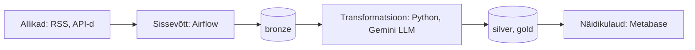

# ut-aik-grupitoo — Eesti uudiste ja finantsandmete ETL-torustik

## Äriküsimus

Projekt seob Eesti majandusuudiste meelsuse finantsturgude liikumistega, et uurida, kuidas uudiste toon mõjutab investeerimiskeskkonda ja finantsnäitajaid. See aitab analüütikutel ja investoritel mõista sentimenti mõju turule.

**Mõõdikud:**

1. **Uudiste meelsuse skoor** — päevane/nädalane kaalutud sentimendi skoor (positiivne / neutraalne / negatiivne) allikate ja kategooriate lõikes.
2. **Euribori muutuse ja uudiste meelsuse korrelatsioon** — kas negatiivse meelsusega uudiste osakaalu kasv langeb ajaliselt kokku Euribori tõusuga ja vastupidi.
3. **Indeksfondi tootluse ja uudiste sentimendi suhe** — kuidas globaalse indeksfondi (nt S&P 500 / MSCI World) päevane tootlus suhestub Eesti majandusuudiste meelsusega.

## Arhitektuur



Täpsem kirjeldus: [`docs/arhitektuur.md`](docs/arhitektuur.md)

## Andmestik

| Allikas | Tüüp | Ajas muutuv? | Roll |
|---------|------|--------------|------|
| ERR RSS | RSS/XML | Jah, pidevalt | Põhiandmevoog |
| Äripäev RSS | RSS/XML | Jah, pidevalt | Põhiandmevoog |
| ECB Data API – Euribor | REST API (SDMX) | Jah, igal pangapäeval | Põhiandmevoog |
| Alpha Vantage – Indeksfond | REST API | Jah, igal kauplemispäeval | Põhiandmevoog |
| Google Gemini Flash API | REST API | Nõudmisel | Transformatsioon (Sentiment) |

## Stack

| Komponent | Tööriist |
|-----------|---------|
| Sissevõtt | Python (requests, lxml, BeautifulSoup), Apache Airflow |
| Transformatsioon | Python, Google Gemini 3.0 Flash API |
| Andmehoidla | PostgreSQL (AWS RDS) |
| Näidikulaud | Metabase |
| Orkestreerimine | Apache Airflow (Dockeris) |

## Käivitamine

```bash
# 1. Klooni repo ja liigu kausta
git clone <repo-url>
cd ut-aik-grupitoo

# 2. Kopeeri keskkonnamuutujad
cp EC2/airflow/.env.example EC2/airflow/.env
# Muuda .env failis API võtmed ja andmebaasi seaded

# 3. Andmebaasi algseadistus
# Käivita RDS/db_setup.sql lokaalses või kaug-PostgreSQL andmebaasis, et luua `db_news` andmebaas ja skeemid.

# 4. Käivita teenused Airflow jaoks
cd EC2/airflow/
docker compose up -d

# 5. [Vabatahtlik: käivita pythoni lokaalne keskkond]
# pip install -r requirements.txt
```

Airflow: http://localhost:8080 (kasutaja: airflow / parool: airflow)
Näidikulaud: Metabase töötab vastavalt seadistatud pordile (vajab Metabase konteineri käivitamist ja ühendamist andmebaasiga).

## Saladused ja konfiguratsioon

Kõik saladused on `EC2/airflow/.env` failis. Repos on ainult `.env.example`.

Vajalikud muutujad:

| Muutuja | Tähendus | Näide |
|---------|----------|-------|
| `POSTGRES_USER` | PostgreSQL kasutaja | `admin` |
| `POSTGRES_PASSWORD` | PostgreSQL parool | (saladus) |
| `POSTGRES_DB` | PostgreSQL andmebaasi nimi | `db_news` |
| `GEMINI_API_KEY` | Google Gemini API võti | (saladus) |
| `ALPHA_VANTAGE_API_KEY` | Alpha Vantage API võti | (saladus) |

## Andmevoog lühidalt

1. **Sissevõtt** — Airflow DAG käivitub iga 2 tunni tagant ja tõmbab RSS-voogudest uudised ning API-dest finantsandmed. Kasutatakse inkrementaalset laadimist.
2. **Laadimine** — Toorandmed laaditakse muutmata kujul `bronze` kihti (PostgreSQL).
3. **Transformatsioon** — Gemini API abil määratakse uudistele meelsus (-1.0 kuni 1.0). Andmed puhastatakse (duplikaatide eemaldamine, kuupäevade normaliseerimine) ja laaditakse `silver` kihti. Finantsandmed joondatakse kalendripäevadele.
4. **Agregeerimine** — `gold` kihti luuakse kokkuvõtvad tabelid (päevane uudiste kokkuvõte, finantsindikaatorite tabel).
5. **Testimine** — Enne `gold` kihti viimist kontrollitakse andmekvaliteeti (NULL-testid, unikaalsus, väärtuste vahemikud).
6. **Näidikulaud** — Metabase loeb andmeid `silver` ja `gold` kihtidest ning kuvab analüütilisi dashboarde.

## Andmekvaliteedi testid

Projekt kontrollib järgmist:

1. **NOT NULL test** — `title`, `link`, `news_dtime` ja `sentiment_score` ei ole NULL.
2. **Unikaalsuse test** — uudiste `link` väärtused on unikaalsed.
3. **Väärtuste vahemiku test** — `sentiment_score` jääb vahemikku [-1.0, 1.0] ja `news_dtime` ei ole tulevikus.
4. **Värskuse test** — kontrollitakse, et viimane uudis pole vanem kui 6 tundi.

Testide tulemused: Logitakse Airflow tööde logidesse andmekvaliteedi testi sammul (`data_quality_tests.py`).

## Projekti struktuur

```
.
├── README.md
├── docs/
│   └── arhitektuur.md      ← Arhitektuuri ja andmevoo detailne kirjeldus
├── EC2/
│   └── airflow/
│       ├── docker-compose.yaml  ← Airflow käivitamiseks
│       ├── requirements.txt
│       └── ...                  ← DAG-id ja ammutamise skriptid
├── RDS/
│   └── db_setup.sql        ← Andmebaasi skeemide ja tabelite loomine
└── metabase/               ← Metabase konfiguratsioon ja failid
```

## Kokkuvõte, puudused ja võimalikud edasiarendused

**Kokkuvõte:**
- ETL torustiku disain on valmis ja peamised andmevood defineeritud (uudised ja finantsandmed).
- Arhitektuur toetab inkrementaalset laadimist ning andmete kihistamist (bronze, silver, gold).

**Puudused:**
- LLM (Gemini) API tasuta kihi limiidid (RPM/RPD) võivad vajada spetsiaalset piiramist (rate-limiting) suuremate andmemahtude korral.
- Pilveinfrastruktuuri (AWS) kulude ja monitooringu täpne seadistamine vajab veel tähelepanu.

**Mis edasi:**
- Lisada täiendavaid uudiste või sotsiaalmeedia allikaid (nt Twitter/X või Reddit).
- Ehitada sügavam analüütiline mudel, mis reaalajas ennustab turu muutusi.

## Meeskond

| Nimi | Roll |
|------|------|
| Kaido Kariste | Andmeinsener |
| Allar Laane | Andmeinsener |
| Laurynas Matušaitis | Andmeinsener |
| Arno Pilvar | Andmeinsener |
