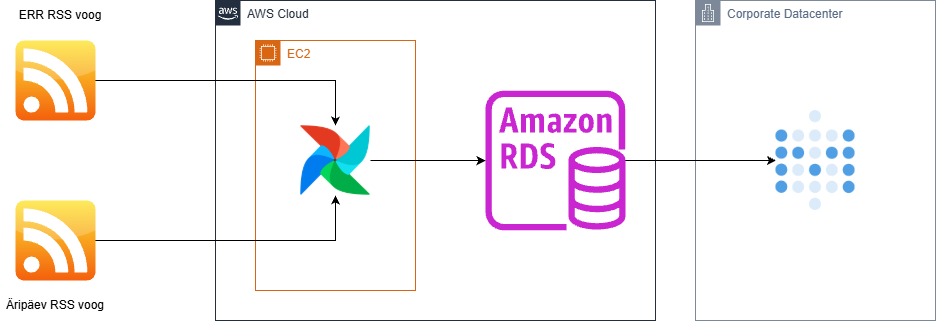

# Arhitektuur

> **Juhend:** See fail on projektitöö esimese nädala väljund. Asenda kõik nurksulgudes plankid oma projekti tegeliku sisuga. Kustuta see juhendrida.

## Äriküsimus

Geopoliitiliste kriiside ja nendega seotud isikute kajastatuse osakaal ning temaatiline jaotus Eesti meediamaastikul ERR-i ja Äripäeva uudistevoogude näitel.

## Mõõdikud

1. Millise osakaalu kogu meediamahtudest moodustavad sihtriikidega (USA, Iraan, Iisrael, Ukraina, Venemaa) ja nendega seotud isikutega seonduvad uudised ERR-i ning Äripäeva päeva lõikes. Kogume valimi märksõnu nagu "USA, Trump, Iraan ... jne." Loeme kokku uudised, mis päevas sisaldavad neid sõnu ja vaatame kogusuhet päevastesse uudistesse.
2. Millistes temaatilistes kategooriates ja rubriikides nimetatud meediakanalid antud geopoliitilisi konflikte kajastavad? Uudistel on olemas kategooriad. Grupeerime ülalnimetatud märksõnadega uudised neisse kategooriatesse.

## Andmeallikad

| Allikas | Tüüp | Ajas muutuv? | Roll |
|---------|------|--------------|------|
| [ERR RSS](https://www.err.ee/rss) | [RSS] | Jah, iga tund | [Uudiste sisselugemine XML-st] |
| [Äripäev RSS](http://feeds.feedburner.com/aripaev-rss) | [RSS] | Jah, iga tund  | [Uudiste sisselugemine XML-st] |

## Andmevoog

> Täpsusta diagrammi vastavalt oma projektile — lisa rohkem andmeallikaid, mudeleid või teenuseid.

## Andmebaasi kihid

| Kiht | Roll |
|------|------|
| `bronze` | Hoiab allika andmeid töötlemata kujul. |
| `silver` | Hoiab transformeeritud ja ärilogikat sisaldavaid tabeleid. |
| `gold` | Puhastatud, rikastatud andmestik. |

## Tööjaotus

| Roll | Vastutus | Täitja |
|------|----------|--------|
| Andmeallika omanik | Kirjutab sissevõtu loogika, hoiab API-t töös | [Kaido Kariste] |
| Transformatsioonide omanik | Kirjutab mart kihi mudelid ja mõõdikute arvutuse | [Nimi] |
| Kvaliteedi omanik | Kirjutab testid ja vaatab läbi ebaõnnestunud kontrollid | [Nimi] |
| Näidikulaua omanik | Ehitab näidikulaua ja seob selle äriküsimusega | [Allar Lääne] |

## Riskid

| Risk | Mõju | Maandus |
|------|------|---------|
| [Risk 1 — näiteks: API ei vasta] | [Mis juhtub?] | [Kuidas maandad?] |
| [Risk 2] | [Mis juhtub?] | [Kuidas maandad?] |
| [Risk 3] | [Mis juhtub?] | [Kuidas maandad?] |

## Privaatsus ja turve

[Kirjelda, millised isiku- või tundlikud andmed teie projektis esinevad (kui üldse) ja kuidas neid kaitsete. Isikuandmed peavad olema anonümiseeritud. Andmebaasi paroolid peavad tulema `.env` failist.]
