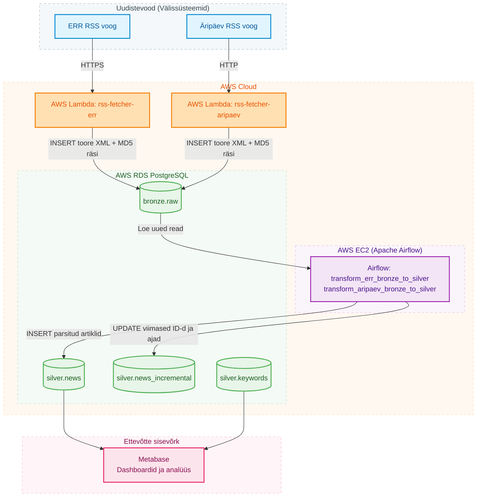
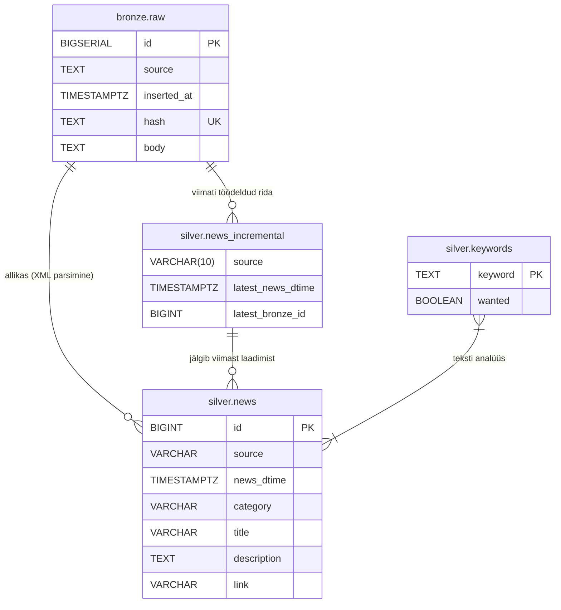

# Arhitektuur

## Äriküsimus

Geopoliitiliste kriiside ja nendega seotud isikute kajastatuse osakaal ning temaatiline jaotus Eesti meediamaastikul ERR-i ja Äripäeva uudistevoogude näitel.

## Mõõdikud

1. Millise osakaalu kogu meediamahtudest moodustavad sihtriikidega (USA, Iraan, Iisrael, Ukraina, Venemaa) ja nendega seotud isikutega seonduvad uudised ERR-i ning Äripäeva päeva lõikes. Kogume valimi märksõnu nagu "USA, Trump, Iraan ... jne." Loeme kokku uudised, mis päevas sisaldavad neid sõnu ja vaatame kogusuhet päevastesse uudistesse.
2. Millistes temaatilistes kategooriates ja rubriikides nimetatud meediakanalid antud geopoliitilisi konflikte kajastavad? Uudistel on olemas kategooriad. Grupeerime ülalnimetatud märksõnadega uudised neisse kategooriatesse.

## Andmeallikad

| Allikas | Tüüp | Ajas muutuv? | Roll |
|---------|------|--------------|------|
| [ERR RSS](https://www.err.ee/rss) | RSS | Jah, iga tund | Põhiandmevoog |
| [Äripäev RSS](http://feeds.feedburner.com/aripaev-rss) | RSS | Jah, iga tund  | Põhiandmevoog |

## Andmevoog

Projekti andmevoog on jagatud kaheks eraldiseisvaks etapiks (Separation of Concerns):

1. **Sissevõtt (Extract):** AWS Lambda funktsioonid pärinevad RSS voogudest andmeid ja salvestavad toore XML-i otse RDS andmebaasi `bronze.raw` tabelisse. Kuna Lambda on serverless ja tasuta limiidid/kulud on minimaalsed, saab seda jooksutada tihedalt. See tagab, et me ei kaota andmeid ka siis, kui Airflow server on maas.
2. **Transformatsioon (Transform & Load):** Airflow DAG-id (`transform_err_bronze_to_silver` ja `transform_aripaev_bronze_to_silver`) loevad toorandmeid skeemist `bronze`, parsivad XML-i, puhastavad andmed ja laadivad need `silver.news` tabelisse. Kuna EC2 instantsi jooksutamine Airflow jaoks on kallis, hoitakse Airflow-d töös vaid vajadusel (nt testimise ajal ja käsitsi käivitamisel või tunnisel graafikul).

Inkrementaalseks laadimiseks kasutatakse `latest_bronze_id` veergu `silver.news_incremental` tabelis, et vältida juba töödeldud ridade uuesti parsimist.

## Andmebaasi kihid

| Kiht | Roll |
|------|------|
| `bronze` | Hoiab allika toorandmeid töötlemata kujul (`bronze.raw` tabelis). |
| `silver` | Hoiab transformeeritud, parsitud ja filtreeritud andmeid (`silver.news`, stoppsõnu/märksõnu `silver.keywords`). |
| `gold` | Puhastatud, rikastatud andmestik (agregeeritud vaated ja tabelid ärianalüütika jaoks). |

## Praegune andmebaasi olem-seose mudel (ERD)

## Tööjaotus

| Roll | Vastutus | Täitja |
|------|----------|--------|
| Andmeallika omanik | Kirjutab sissevõtu loogika, hoiab API-t töös | Kaido Kariste |
| Transformatsioonide omanik | Kirjutab mart kihi mudelid ja mõõdikute arvutuse | Arno Pilvar |
| Kvaliteedi omanik | Kirjutab testid ja vaatab läbi ebaõnnestunud kontrollid | Laurynas Matušaitis |
| Näidikulaua omanik | Ehitab näidikulaua ja seob selle äriküsimusega | Allar Lääne |

*rollid on paindlikud ning muutuvad jooksvalt vastavalt vajadusele.

## Riskid

| Risk | Mõju | Maandus |
|------|------|---------|
| Risk 1 - Uudistevoo URL-i liigutatakse | Airflow DAG peaks minema katki | Kasutaks "One failed" dagi |
| Risk 2 - Uudistevoo struktuur muutub | DAG hakkab saama tühje tulemusi | NOT NULL piirangud andmebaasis |
| Risk 3 - Sama uudis mitmes kategoorias | Mõned märksõnad hakkavad võimenduma | Enne dashboardi unikaalsus läbi SQL.  |

## Privaatsus ja turve

Kõik andmed on avalikud uudised.
