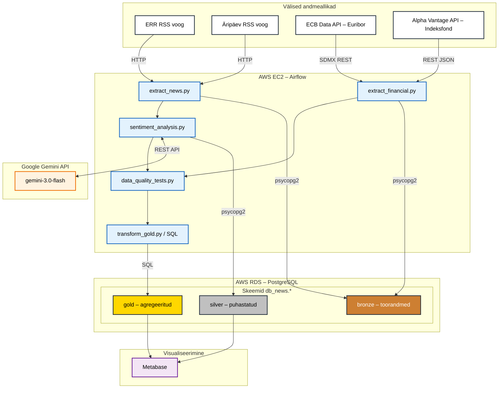

# Projekti Arhitektuur

See dokument kirjeldab Eesti uudiste ja finantsandmete ETL-torustiku arhitektuuri, äriküsimust, andmeallikaid ja andmevoogusid.

---

## Äriküsimus

**Kas Eesti uudiste meelsus (sentiment) korreleerub finantsturgude liikumistega ja kuidas mõjutab uudiste toon investeerimiskeskkonda?**

### Mõõdikud (KPI-d)

1. **Uudiste meelsuse skoor** — päevane/nädalane kaalutud sentimendi skoor (positiivne / neutraalne / negatiivne) allikate ja kategooriate lõikes.
2. **Euribori muutuse ja uudiste meelsuse korrelatsioon** — kas negatiivse meelsusega uudiste osakaalu kasv langeb ajaliselt kokku Euribori tõusuga ja vastupidi.
3. **Indeksfondi tootluse ja uudiste sentimendi suhe** — kuidas globaalse indeksfondi (nt S&P 500 / MSCI World) päevane tootlus suhestub Eesti majandusuudiste meelsusega.

---

## Arhitektuuri joonis

---

## Andmeallikad

| # | Allikas | Tüüp | Muutuvus | Formaat | Autentimine |
|---|---------|------|----------|---------|-------------|
| 1 | **ERR RSS** (`err.ee/rss`) | RSS/XML | Reaalajas, uueneb pidevalt uute uudistega | XML (RSS 2.0) | Ei vaja |
| 2 | **Äripäev RSS** (`feeds.feedburner.com/aripaev-rss`) | RSS/XML | Reaalajas, uueneb pidevalt uute uudistega | XML (RSS 2.0) | Ei vaja |
| 3 | **ECB Data API – Euribor** (`data-api.ecb.europa.eu`) | REST API (SDMX) | Uueneb igal pangapäeval, avaldatakse reeglina kell 11:00 CET | JSON / CSV | Ei vaja (avalik) |
| 4 | **Alpha Vantage – Indeksfond** (`alphavantage.co`) | REST API | Uueneb igal kauplemispäeval (sulgemishind) | JSON | API võti (tasuta) |
| 5 | **Google Gemini Flash API** (`generativelanguage.googleapis.com`) | REST API | Kutsutakse nõudmisel | JSON | API võti  (tasuta)|

---

## Andmevoog (ETL protsess)

### 1. Ammutamine (Extract) → `bronze` skeemi

Airflow DAG käivitub iga 2 tunni tagant (`0 */2 * * *`) ja teostab paralleelselt:

- **Uudiste ammutamine** (`extract_news.py`): pärib ERR ja Äripäev RSS-voogudest artiklid, parsib XML-i BeautifulSoup-iga. Kasutab inkrementaalset laadimist — `bronze.news_incremental` tabeli benchmark-i põhjal laaditakse ainult uued uudised.
- **Finantsandmete ammutamine** (`extract_financial.py`): pärib ECB-lt Euribori intressimäärad (3 kuu ja 6 kuu) ning Alpha Vantage-st indeksfondi päevaseid sulgemishindu.

Toorandmed salvestatakse `bronze` skeemi muutmata kujul.

### 2. Töötlemine (Transform) → `silver` skeemi

- **Sentimendi analüüs** (`sentiment_analysis.py`): iga uudise pealkirjale ja kirjeldusele tehakse meelsusanalüüs Google Gemini Flash API abil. Tulemuseks on sentimendi skoor (-1.0 kuni +1.0) ja kategooria (positiivne / neutraalne / negatiivne).
- **Andmete puhastamine**: duplikaatide eemaldamine, kategooriate standardiseerimine, kuupäevade normaliseerimine UTC-sse, tühjade väljade käsitlemine.
- **Finantsandmete joondamine**: Euribori ja indeksfondi andmed joondutatakse kalendripäevadele (pangapäevadel forward-fill).

### 3. Kvaliteedikontroll → enne `gold` skeemi

Vähemalt 3 andmekvaliteedi testi iga pipeline-i käivituse lõpus:

1. **NOT NULL test** — kontrollitakse, et `title`, `link`, `news_dtime` ja `sentiment_score` ei ole NULL.
2. **Unikaalsuse test** — kontrollitakse, et `link` väärtused on unikaalsed (duplikaatide tuvastamine).
3. **Väärtuste vahemiku test** — kontrollitakse, et `news_dtime` ei ole tulevikus ja `sentiment_score` jääb vahemikku [-1.0, 1.0].
4. *(Lisa)* **Värskuse test** — kontrollitakse, et viimane kirje pole vanem kui 6 tundi.

### 4. Agregeerimine → `gold` skeemi

- **Päevane uudiste kokkuvõte**: uudiste arv, keskmine sentimendi skoor, kategooriate jaotus allikate kaupa.
- **Finantsindikaatorite tabel**: Euribori määrad ja indeksfondi hinnad joondutatult päevastele uudiste kokkuvõtetele.
- **Korrelatsioonitabel**: sentimendi keskmise ja finantsandmete muutuse võrdlustabel aegridade analüüsiks.

### 5. Visualiseerimine → Metabase

Metabase ühendub `gold` ja `silver` skeemidega ning kuvab dashboardi, mis sisaldab vähemalt:

- **KPI 1**: Uudiste meelsuse trendijoon (päevane keskmine sentimendi skoor) koos Euribori kõveraga.
- **KPI 2**: Uudiste kategooriate jaotus (tulpdiagramm) koos sentimendi värvikoodidega.
- *(Lisa)* Indeksfondi tootluse ja sentimendi hajuvusdiagramm (scatter plot).

---

## Tööjaotus **WORK IN PROGRESS**
| Vastutaja | Peamised ülesanded |
|-----------|-------------------|
| **Kaido Kariste** | ... |
| **Allar Laane** | ... |
| **Laurynas Matušaitis** | ... |
| **Arno Pilvar** | ... |

*Märkus: Kõik liikmed aitavad vajadusel teistes valdkondades.*

---

## Riskid

| # | Risk | Tõenäosus | Mõju | Leevendamine |
|---|------|-----------|------|--------------|
| 1 | **Gemini API piirangud** — tasuta kihil on päevased limiidid (RPD/RPM) | Kõrge | Kõrge | Päringute optimeerimine (batch-analüüs mitmele uudisele korraga), fallback Vertex AI-le või tasulisele API-le. Sentimendi analüüs ei pea olema reaalajas — saab teha ajaviitväliselt. |
| 2 | **RSS-voo struktuurimuutus** — ERR või Äripäev muudab RSS-i formaati | Madal | Kõrge | Vigade püüdmine (try/except) DAG-ides, monitooring Airflow alertidega, parserile testid. |
| 3 | **AWS kulude kontroll** — EC2 ja RDS jooksmine ööpäevaringselt | Keskmine | Keskmine | Kasutada väiksemaid instansse (t3.micro / db.t3.micro), seadistada ajapõhised peatamised väljaspool aktiivset perioodi. |

---

## Tehniline virn

| Komponent | Tehnoloogia |
|-----------|-------------|
| Keel | Python 3.x |
| Orkestreerimine | Apache Airflow (Dockeris, CeleryExecutor) |
| Andmebaas | PostgreSQL (AWS RDS) |
| Sentimendi analüüs | Google Gemini Flash API (`gemini-3.0-flash-preview`) |
| Visualiseerimine | Metabase (Dockeris) |
| Infrastruktuur | AWS EC2, AWS RDS |
| Peamised teegid | `beautifulsoup4`, `psycopg2-binary`, `requests`, `python-dateutil`, `lxml`, `google-generativeai` |
