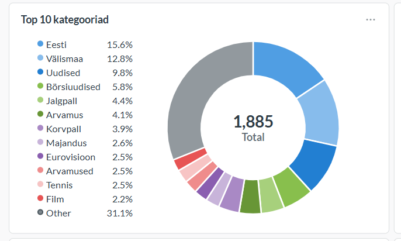

# Edenemisraport

## Mis on valmis

- [X] AWS konto on loodud
- [X] Andmeid saadakse allikast kätte (ERR ja Äripäev RSS-vood)
- [X] Andmed laetakse `silver` kihti inkrementaalselt
- [X] Vähemalt üks transformatsioon toimib (kuupäevade parsijad ja teemade filtreerimine)
- [X] Vähemalt üks näidikulaud on nähtaval (Metabase seadistatud)
- [X] Tooranmedete `bronze` kihti laadimine AWS lambda funktsioonide abil
- [ ] Vähemalt üks andmekvaliteedi test läbib

Andmevoog on otsast lõpuni käivitatav (allikast `silver` kihti ja sealt visuaali). Airflow DAG-id on seadistatud jooksma ja andmed laetakse andmebaasi, vältides dubleerimist (kasutades `news_incremental` tabelit).

Esimene visuaal:

## Järgmised sammud (Sprint 3)

- Toorandmete `bronze`-ist `silver`-isse laadimine:

    Hetkel tehakse toorandmete sissevõtt, transformatsioon ja talletus `silver` tabelisse ühe  airflow DAG-i poolt. Lisaks on implementeertiud tooranmete salvestamine `bronze` kihti AWS lambda funktsiooni abil. Järgmise sammuna on plaanis kohandada Airflow DAG ainult transofrmatsiooni tegemise jaoks, et tekiks ülesannete eraldatus.
- Andmekvaliteedi testide (näiteks dubleerivate uudiste kontrolli) lisamine eraldiseisva Airflow DAG-i kaudu.
- Visuaalide täiendamine ja viimistlemine Metabase'is.
- Andmemudeli dokumentatsiooni ja arhitektuuri jooniste täpsustamine.

## Mis takistab

- Praegu ei ole otseseid blokeerivaid probleeme.
- Tehniline võlg: Hetkel laetakse andmed skriptiga otse `silver` kihti.

## Kontrollpunkt

**Märkus infrastruktuuri kohta:** Projekti komponendid on hetkel hajutatud (Airflow asub AWS EC2 virtuaalmasinas, andmebaas on AWS RDS teenuses ning Metabase asub ettevõtte sisevõrgus). Seetõttu ei ole projekti toimivust kolmandal osapoolel võimalik lokaalselt (näiteks `docker compose up` käsuga) lihtsalt kontrollida, samuti pole ühe käsuga ülesseadmine olnud eesmärgiks.

Andmevoo otsast-lõpuni toimimise peamiseks tõestuseks on esitatud ülaltoodud väljavõte Metabase'ist. Vajadusel saame tehnilist toimivust ja andmebaasi sisu täiendavalt demonstreerida (nt üle ekraanijagamise).
