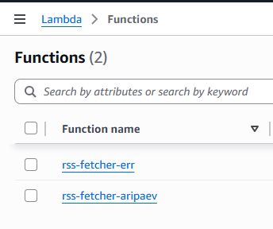
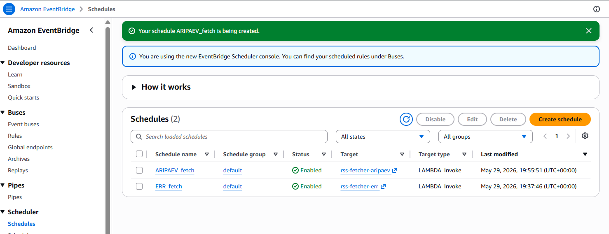
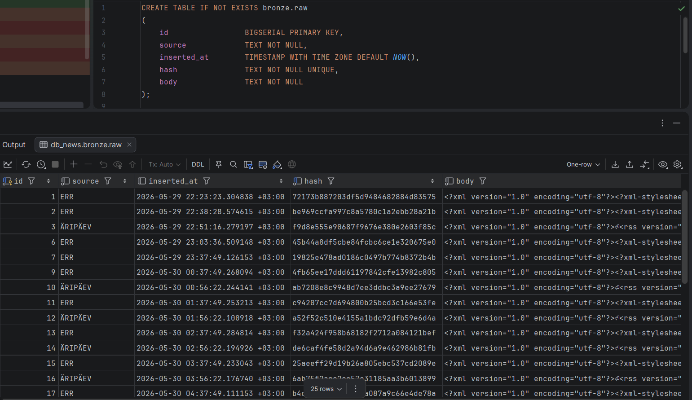

# Lambda — RSS andmete laadimine bronze kihti

AWS Lambda funktsioonid tõmbavad RSS voogudest toored XML-andmed ja salvestavad need `bronze.raw` tabelisse RDS andmebaasis. Tegemist on alternatiivse sissevõtukanaliga Airflow ETL-ile — Lambda funktsioonid käivitatakse Amazon EventBridge ajastuste kaudu.

## Funktsioonid

Projektis on kolm Lambda funktsiooni:

| Funktsioon | Allikas |
|-----------|---------|
| `rss-fetcher-err` | [ERR RSS](https://www.err.ee/rss) |
| `rss-fetcher-aripaev` | [Äripäev RSS](http://feeds.feedburner.com/aripaev-rss) |
| `rss-fetcher-postimees` | [Postimees RSS](https://postimees.ee/rss) |



## Tööpõhimõte

Iga Lambda funktsioon teeb järgmist:

1. **RSS allalaadimine** — tõmbab RSS voo XML-i `urllib.request` abil
2. **Räsi arvutamine** — arvutab MD5 räsi deduplikatsiooni jaoks
3. **Bronze kihti salvestamine** — sisestab toore XML-i `bronze.raw` tabelisse koos allikaga ja räsiga
4. **Deduplikatsioon** — kasutab `ON CONFLICT (hash) DO NOTHING`, et vältida duplikaate

### Andmebaasi ühendus

- Ühendub RDS PostgreSQL andmebaasiga `pg8000` draiveri kaudu
- Andmebaasi parool on krüpteeritud AWS KMS abil ja dekrüpteeritakse Lambda käivitusfaasis (cold start optimisation)

### Keskkonnamuutujad

| Muutuja | Kirjeldus |
|---------|-----------|
| `SOURCE_NAME` | Allika nimi (nt `ERR`, `ARIPAEV`) |
| `RSS_URL` | RSS voo URL |
| `DB_HOST` | RDS hosti aadress |
| `DB_PORT` | Andmebaasi port (vaikimisi 5432) |
| `DB_NAME` | Andmebaasi nimi |
| `DB_USER` | Andmebaasi kasutaja |
| `DB_PASSWORD` | KMS krüpteeritud parool |

## EventBridge ajastused

Lambda funktsioonid käivitatakse automaatselt Amazon EventBridge Scheduler abil 1 kord tunnis:

| Ajastus | Sihtfunktsioon | Tüüp |
|---------|---------------|------|
| `ARIPAEV_fetch` | `rss-fetcher-aripaev` | LAMBDA_Invoke |
| `ERR_fetch` | `rss-fetcher-err` | LAMBDA_Invoke |
| `POSTIMEES_fetch` | `rss-fetcher-postimees` | LAMBDA_Invoke |



## Bronze kihi andmed

Lambda salvestab toored RSS XML-andmed `bronze.raw` tabelisse:

| Veerg | Tüüp | Kirjeldus |
|-------|------|-----------|
| `id` | BIGSERIAL | Automaatne primaarvõti |
| `source` | TEXT | Allika nimi (ERR / ÄRIPÄEV / POSTIMEES) |
| `inserted_at` | TIMESTAMPTZ | Sisestamise ajatempel |
| `hash` | TEXT (UNIQUE) | MD5 räsi deduplikatsiooniks |
| `body` | TEXT | Toore RSS XML sisu |



## Failide struktuur

```
lambda/
├── lambda_function.py   # Lambda funktsiooni kood
├── lambda1.png          # Lambda funktsioonide kuvatõmmis
├── lambda2.png          # EventBridge ajastuste kuvatõmmis
├── lambda3.png          # Bronze kihi andmete kuvatõmmis
└── README.md
```
